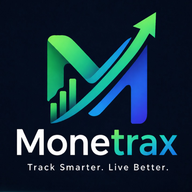

  

  <h1>Monetrax</h1>
  
<strong>Track Smarter. Live Better.</strong>

  
A free, private, installable finance tracker that runs entirely in your browser — no account, no server, no subscription.

   

  
  
  
  

---

## What is Monetrax?

Monetrax is a personal finance tracker you install straight from your browser — no app store, no sign-up, no fees. It works offline, keeps all your data on your own device, and looks and feels like a native app on both Android and iOS.

Built for people who want a clear, honest picture of where their money goes — without handing their financial life to a third-party service.

---

## Features

### 💰 Track every transaction
Log income, expenses and transfers in seconds. Smart autocomplete remembers your stores, sources and products so you never type the same thing twice.

### 🛒 Shopping cart calculator
Add items before you reach the checkout counter. Set a budget cap and Monetrax tells you when you're getting close or going over — before you tap your card.

### 📋 Shopping list
A simple checklist that lives alongside your tracker. Add items, tick them off as you shop, leave the rest for next time. Warns you if you try to add something twice.

### 🔁 Recurring transactions
Set up rent, subscriptions, salary or any regular payment once. Monetrax tracks what's due this month and lets you apply it in one tap.

### 📊 Dashboard insights
Every month at a glance: income vs expenses, savings rate, biggest spending category, and average daily spend — colour-coded so you know immediately if you're on track.

### 🤖 AI Insights
Compares this month to last. Flags if your food spending jumped, if your savings rate dropped, or if you're spending more than you earn — in plain language, not jargon.

### 🏦 Multi-account support
Separate balances for your bank account, cash wallet, savings pot and card. Each transaction is tied to an account so your numbers always add up.

### 📁 Export anytime
Download all your transactions as a CSV file — open in Excel, Google Sheets or any spreadsheet app.

---

## Privacy

Monetrax stores **everything on your device** using your browser's local storage. No data is sent to any server. No account is required. If you uninstall the app or clear your browser data, your records go with it — so export regularly if you want a backup.

---

## Supported currencies

€ EUR &nbsp;·&nbsp; $ USD &nbsp;·&nbsp; £ GBP &nbsp;·&nbsp; ₹ INR &nbsp;·&nbsp; ¥ JPY &nbsp;·&nbsp; Fr CHF &nbsp;·&nbsp; kr SEK &nbsp;·&nbsp; zł PLN

---

## Install

| Platform | How |
|---|---|
| Android (Chrome) | Open the link → tap **Install Monetrax** in the banner |
| iPhone / iPad (Safari) | Open the link → tap Share → **Add to Home Screen** |
| Desktop (Chrome / Edge) | Open the link → click the install icon in the address bar |

Once installed it appears on your home screen like any other app and works completely offline.

---

## Browser support

| Browser | Installable | Works offline |
|---|---|---|
| Chrome (Android) | ✅ | ✅ |
| Safari (iOS 16.4+) | ✅ | ✅ |
| Chrome (Desktop) | ✅ | ✅ |
| Edge | ✅ | ✅ |
| Firefox | — | ✅ |

---

  Made with care · No trackers · No ads · No nonsense
   
  <em>Monetrax — Track Smarter. Live Better.</em>

